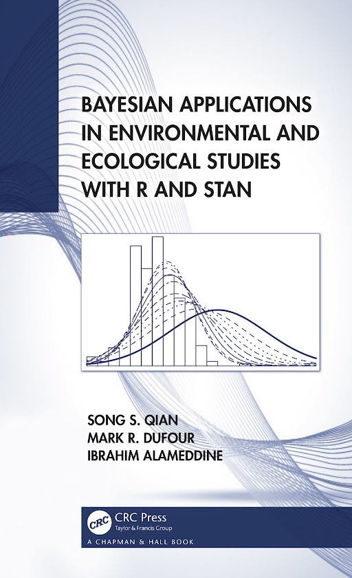

# BeesRStan
This repository includes R scripts, data sets, and the front matter and chapter 1 of the book by Qian, DuFour, and Alameddine (*Bayesian Applications in Environmental and Ecological Studies with R and Stan*). The book is available from the [publisher](https://www.routledge.com/Bayesian-Applications-in-Environmental-and-Ecological-Studies-with-R-and/Qian-DuFour-Alameddine/p/book/9781138497399) or [Amazon](https://www.amazon.com/Bayesian-Applications-Environmental-Ecological-Statistics/dp/1138497398/?_encoding=UTF8&pd_rd_w=XoS27&content-id=amzn1.sym.ed85217c-14c9-4aa0-b248-e47393e2ce12&pf_rd_p=ed85217c-14c9-4aa0-b248-e47393e2ce12&pf_rd_r=138-3007976-0905067&pd_rd_wg=JmTNC&pd_rd_r=bc86f6f8-3aa9-4e8b-8116-c5f15fd17bba&ref_=aufs_ap_sc_dsk)

