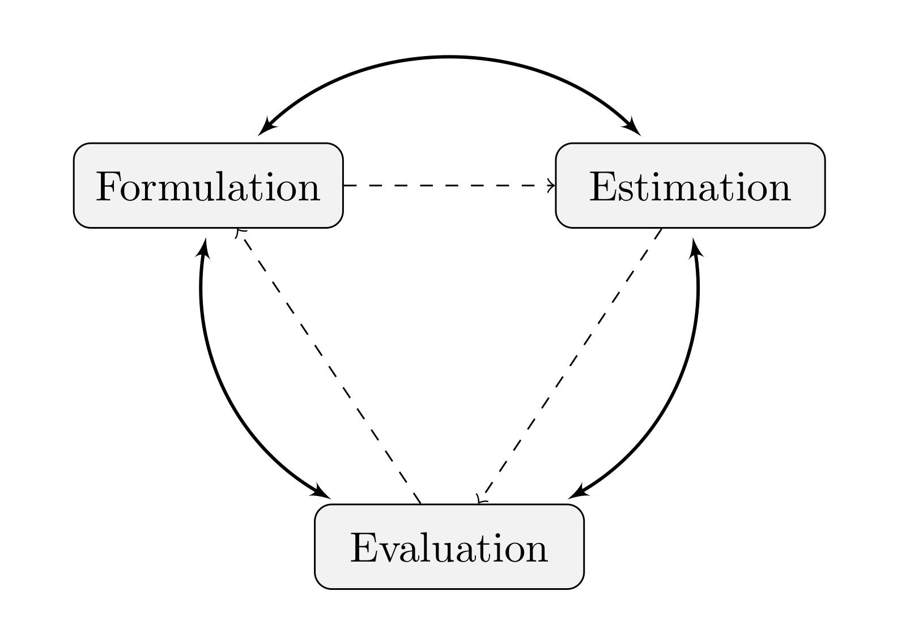

```{r setup, include=FALSE}
knitr::opts_chunk$set(echo = TRUE)
rootDIR <- "https://raw.githubusercontent.com/songsqian/BeesRStan/main/R"
dataDIR <- paste(rootDIR, "Data", sep="/")

packages<-function(x, repos="http://cran.r-project.org", ...){
  x<-as.character(match.call()[[2]])
  if (!require(x,character.only=TRUE)){
    install.packages(pkgs=x, repos=repos, ...)
    require(x,character.only=TRUE)
  }
}

source(paste(rootDIR, "BeesRStan.R", sep="/"))

require(rstan)
packages(rv)
packages(car)
rstan_options(auto_write = TRUE)
options(mc.cores = min(c(parallel::detectCores(), 8)))

nchains <-  min(c(parallel::detectCores(), 8))
niters <- 5000
nkeep <- 2500
nthin <- ceiling((niters/2)*nchains/nkeep)

```
## Introduction

Classical statistics, typically taught in universities, were largely based on Neyman-Pearson's "inductive behavior" approach, which turns an inductive inference problem to a deductive process.  According to Fisher (1922), the inductive nature of statistical inference (we observe data from which to infer the cause) should be approached using **hypothetical deduction**. That is, we propose a hypothesis and derive its logical outcome. Based on the hypothesis, we design an experiment with varied treatments and measure the effect. By comparing the observed results against the predicted (logical outcome) we conclude whether the data is consistent with the initial hypothesis.  The consistency is measured by the *p*-value, the smaller the *p*-value the less consistent is the data with the hypothesis. Under Fisher's hypothetical deduction approach, we propose one hypothesis and revise it when the resulting *p*-value is small.  Under the Neyman-Pearson's inductive behavior approach we compare the null and alternative hypotheses and decide which one to accept.  This approach is predicated on rejecting or failing to reject a hypothesis (the null hypothesis). In Neyman-Pearson's own words, there is no "hope of knowing whether each separate hypothesis is true or false."

In ecological research, we are more interested in estimation.  For example, when using a *t*-test, we are not interested in whether the null hypothesis of no difference is true. It is always false (at least we believe so, otherwise we can't justify the grant behind the experiment). What we really want to know is the magnitude of the difference. Estimation is the main interest. Consequently, Fisher's hypothetical deduction approach and the Bayesian approach are more relevant to ecologists. 

The Fisherian and the Bayesian approaches often lead to similar results in many simple problems.  Classical statisticians' emphasis on the accessibility of their methods to practitioners led to a vast collection of fast computation algorithms for a large number of statistical models.  As a result, using statistics is often as simple as picking a model and plug data into a computer program (e.r., an R function).  At the same time, the computational difficulty of the Bayesian approach limited its use in only a few very simple situations.  Given its limited use in practice and computational complexity, Bayesian statistics is rarely taught in graduate schools.  With the advent of Markov chain Monte Carlo (MCMC) simulation methods, many computational problems associated with Bayesian statistics disappeared.  With MCMC, we can analyze problems that cannot be easily resolved using available classical statistics models.

### The process of Statistical Inference 

According to Fisher (1922), statistical inference involves resolving three fundamental "problems:"

1. Problem of Formulation: This problem pertains to determining the probability distribution of the response variable.

1. Problem of Estimation: Here, the focus is on estimating the parameters of the model derived from the problem of formulation once data are obtained.

1. Problem of Distribution: This problem involves evaluating the model's fit and performance (quantify estimation uncertainty).



### A Mathematical Summary of the Problem of Estimation

- Probability Distribution Density Function: The density function of the response variable, denoted as $\pi(y, \theta)$.

- Joint Distribution: Given observed data $y_1, y_2, \ldots, y_n$, the aim is to determine the joint distribution $\pi(y_1, y_2, \ldots, y_n, \theta)$. This holds true for both classical and Bayesian inference.

- Classical Statistics: In classical statistics, the joint distribution is expressed as 
$$\pi(y_1, \ldots, y_n, \theta) = \pi(y_1, \ldots, y_n \mid \theta) \pi(\theta).$$
The likelihood function, denoted as $L(\theta; y)$, corresponds to $\pi(y_1, \ldots, y_n \mid \theta)$ and is used for maximum likelihood estimation (MLE). The sampling distribution provides information about uncertainty.

- Bayesian Statistics: In Bayesian statistics, the joint distribution is written (the chain rule) as 
$$\pi(y_1, \ldots, y_n, \theta) = \pi(y_1, \ldots, y_n \mid \theta) \pi(\theta) = \pi(\theta \mid y_1, \ldots, y_n) \pi(y_1, \ldots, y_n),$$
which led to the Bayes theorem: 
$$\pi(\theta \mid y_1, \ldots, y_n) = \frac{\pi(y_1, \ldots, y_n \mid \theta) \pi(\theta)}{\pi(y_1, \ldots, y_n)} \propto \pi(y_1, \ldots, y_n \mid \theta) \pi(\theta).$$
Bayesian inference combines estimation and distribution problems by considering the posterior distribution.

Relationship Between Bayesian Inference and MLE: Bayesian inference can be seen as a generalization of MLE-based classical inference. MLE corresponds to the mode of the posterior distribution when a uniform prior is used.

### From Mathematics to Computation
- Derivative (classical) versus integration (Bayesian)
  - Maximum Likelihood Estimation (MLE): Finding parameter values that maximize the likelihood function, denoted as $\hat{\theta}=arg\ max_{\theta\in\Theta} L(\theta;y)$
  - Bayesian: Calculating the posterior distribution $\pi(\theta\mid y_1,\cdots,y_n)$ using integration: 

$$
\pi(\theta\mid y_1,\cdots,y_n)=\frac{\pi(y_1,\cdots,y_n\mid \theta)\pi(\theta)}{\int\pi(y_1,\cdots,y_n\mid \theta)\pi(\theta)d\theta}
$$

- Classical statistics: A collection of efficient numerical algorithms for quantifying MLEs across various classes of models.
  - Historically, results were tabulated.
  - Nowadays, these algorithms are implemented in software packages such as SAS, SPSS, and R.
- Bayesian statistics: Using Monte Carlo simulation to avoid integration
  - Markov chain Monte Carlo simulation (MCMC) algorithm -- drawing random numbers of $\theta$ from its posterior density function (or a function proportional to it)
  - Evaluation of Posterior Distributions: Posterior distributions of model parameters are evaluated using random samples generated from their posterior distributions.
  - The Bayesian posterior is proportional to the product of the likelihood function and the prior: $L(\theta;y_1,\ldots,y_n)\pi(\theta)$
  - If the observations $y_1,\ldots,y_n$ are independent and identically distributed (i.i.d.), the likelihood function becomes the product of individual likelihoods: $L(\theta;y_1,\ldots,y_n)=\prod_{i=1}^n L(\theta;y_i)$.
  - The logarithm of the posterior is given by: 

$$
\log\left (\pi(\theta\mid y_1,\cdots,y_n) \right ) = \log \left (\pi(\theta)\right )+\sum_{i=1}^n\log \left (L(\theta;y_i)\right )
$$

- `Stan` via `rstan` in R:
  - The `Stan` program implements the MCMC algorithm when the logarithm of the prior $\log\left(\pi(\theta)\right)$ and the logarithm of the likelihood function $\log\left(L(\theta;y_i)\right)$ are provided.

## Example -- Snake Fungal Disease
- Estimating the prevalence of fungal infection in a population of protected snake species in Michigan
  - qPCR test with false positive rate (probability) $f_p$ and false negative rate $f_n$.
  - In a sample of $n$ snakes, $y$ tested positive
  - What is the prevalence of the disease in the population ($\theta$)
- Response variable $y$ modeled by the binomial distribution $y \sim Bin(p, n)$ where $p$ is the probability of testing positive, and $p = \theta(1-f_n)+(1-\theta)f_p$
- The likelihood function $L=p^y(1-p)^{n-y}$
- Log likelihood: $\log(L) = y\log(p) +(n-y)\log(1-p)$
- Using a beta distribution prior for $\theta$: $\pi(\theta) \propto \theta^{\alpha-1}(1-\theta)^{\beta-1}$
- The log posterior density

$$L\pi(\theta\mid y,n) \propto (\alpha-1)\log(\theta)+(\beta-1)\log(1-\theta)+ y\log(p) +(n-y)\log(1-p)$$

- Computational options:
  - Classical statistics: $\hat{p} = y/n$, because MLE is transformation invariant: $\hat{\theta}=\frac{\hat{p}-f_p}{1-(f_p+f_n)}$. 
  Uncertainty: variance of $\text{var}(\hat{p})\approx (1-\hat{p})\hat{p}/n$, variance of $\hat{\theta}$ is $(1/(1-f_p-f_n))^2(1-\hat{p})\hat{p}/n$

```{R mle snake, tidy=TRUE}
n <- 20
y <- 5
fn <- 0.05
fp <- 0.07
p_hat <- y/n
p_hat_sd <- sqrt(p_hat*(1-p_hat)/n)
theta_hat <- (p_hat - fp)/(1-fp-fn)
theta_hat_sd <- p_hat_sd/(1-fp-fn)
```

  - Bayesian 1: brute force numerical integration
  
  Calculating the posterior density over a grid between 0 and 1 and normalize the results.
```{R bayes snake 1, tidy=TRUE, fig.width=4.5, fig.height=3.25, dev="tikz"}
## prior beta(1,1)
  post_impft <- function(x=5, n=20, fp=0.07, fn=0.05, k=100){
    theta <- seq(0, 1,, k)
    fpst <- theta*(1-fn) + (1-theta)*fp
    post <- x*log(fpst) + (n-x)*log(1-fpst)
    return(list(pdf=exp(post)/(theta[2]*sum(exp(post))), 
                cdf=cumsum(exp(post))/sum(exp(post))))
}

k <- 100
post_theta <- post_impft(k=k)
par(mar=c(3, 3, 1, 0.5), mgp=c(1.25, 0.125, 0), las=1, tck=-0.01)
plot(seq(0, 1,,k), post_theta$pdf, type="l", xlab="$\\theta$",
     ylab="$\\pi(\\theta|y)$")

## the mean: expected value
theta_seq <- seq(0,1,,k)
theta_mean <- theta_seq[2]*sum(post_theta$pdf * seq(0,1,,k))
theta_sd <- sqrt(sum(theta_seq[2]*post_theta$pdf*(seq(0,1,,k)-theta_mean)^2))

## mode = MLE
theta_mod <- theta_seq[post_theta$pdf==max(post_theta$pdf)]

## median
theta_med <- theta_seq[post_theta$cdf-0.5==min(abs(post_theta$cdf-0.5))]

## 5%- and 95% -tiles
theta_CI <- c(theta_seq[post_theta$cdf-0.05==min(abs(post_theta$cdf-0.05))], 
              theta_seq[post_theta$cdf-0.95==min(abs(post_theta$cdf-0.95))])
```
  - Bayesian 2: Monte Carlo simulation
  
    Directly draw random numbers from the posterior distribution using the inverse-CDF method

```{R bayes snake 2, tidy=TRUE, fig.width=4.5, fig.height=3.25, dev="tikz"}
## Using evenly spaced pdf from Chapter 1
post_impft_cdf <- function(x=5, n=20, fp=0.07, fn=0.05, k=100){
    theta <- seq(0, 1,, k)
    fpst <- theta*(1-fn) + (1-theta)*fp
    post <- x*log(fpst) + (n-x)*log(1-fpst)
    return(cumsum(exp(post)/sum(exp(post))))
}

n_sims<-5000
post_cdf <- data.frame(theta=seq(0,1,,5000), cdf=post_impft_cdf(k=5000))
u <- runif(n_sims)
tmp <- apply(post_cdf, 1, function(x, unf)
     return(x[2]-unf), unf=u)

theta <- apply(tmp, 1, function(x, theta)
     return(theta[abs(x)==min(abs(x))]),
              theta=post_cdf$theta)
hist(theta, xlab="$\\theta$")
mean(theta)
sd(theta)
median(theta)
quantile(theta, prob=c(0.05,0.95))
```
  - Bayesian 3: Using Metropolis-Hastings algorithm (See Section 2.4.1)
  An acceptance-rejection method (Section 2.3.2) with a candidate-generating distribution function and the acceptance probability probability is based on the ratio of posterior density function at two points. As a result, we only need to know the posterior density up to a proportional constant.   

```{R bayes snake 3, tidy=TRUE, fig.width=4.5, fig.height=3.25, dev="tikz"}
set.seed(10)
theta <- numeric()
theta[1] <- runif(1) # initial value

n <- 20
x <- 5
log_lk <- function(theta, x=5, n=20, fp=0.07, fn=0.05){
    pp <- theta*(1-fn)+(1-theta)*fp
    llk <- x*log(pp)+(n-x)*log1p(-pp)
    return(llk)
}

for (j in 1:n_sims){
  y <- runif(1) ## unif(0,1) as the candidate-generating function
  alpha <- exp(log_lk(y)-log_lk(theta[j]))
  if (runif(1) < alpha)    theta[j+1] <- y
   else 
    theta[j+1] <- theta[j]
  
}

theta <- theta[round(1+n_sims/2):n_sims]

hist(theta, xlab="$\\theta$")
mean(theta)
sd(theta)
median(theta)
quantile(theta, prob=c(0.05,0.95))
```

### Stan through `rstan`

  - Bayesian 4: Using Stan

  The basic task of Bayesian computation is to derive the posterior distribution
  
$$
\pi(\theta\mid y_1,\cdots,y_n) \propto \pi(\theta)L(\theta; y_1,\cdots,y_n)
$$
  
Using Stan, we draw random samples of the unknown parameters $\theta$ from their joint posterior distribution. As we know from the Metropolis-Hastings algorithm, we can draw random samples by knowing the posterior density up to a proportional constant. The rest can be automatic using a computer. In a Bayesian computing software, we need to provide three groups of information to formulate the MCMC algorithm.

1. Input data (e.g., $y, n, f_p, f_n$)
2. Parameters to be estimated 
3. The likelihood function and prior distributions 

Stan puts the above three groups of information in three code blocks. For the snake fungal example, we have $x=5, n=20$, $f_p=0.07$ and $f_n=0.05$. The response variable ($y$) is assumed to follow a binomial distribution $y \sim Bin(p, n)$, with the probability of a positive result being $p=\theta(1-f_n)+(1-\theta)f_p)$. Translating to Stan, we have

```{R bayes snake stan code, tidy=TRUE}
### Stan Code ###
snake_code1 <- "
  data{
    int<lower=1> n;
    int<lower=0> y;
    real<lower=0,upper=1> fn;
    real<lower=0,upper=1> fp;
  }
  parameters{
    real<lower=0,upper=1> theta;
  }
  model{
    theta ~ beta(1,1);
    y ~ binomial(n, theta*(1-fn) + (1-theta)*fp );
  }
"
```

We can also specify log-likelihood function directly by changing the `model` block to:

```
model{
   theta ~ beta(1,1);
   target += y*log(theta*(1-fn)+(1-theta)*fp)+
             (n-y)*log(1-theta*(1-fn)-(1-theta)*fp);
}
```
We can also add a `transformed parameters` block to clarify the code:
```
transformed parameters{
   real<lower=0,upper=1> p_pos;
   p_pos = theta*(1-fn)+(1-theta)*fp;
}
model{
   theta ~ beta(1,1);
   target += y*log(p_pos)+(n-y)*log(1-p_pos);
}
```

or directly use the log-probability function come with Stan:

```
transformed parameters{
   real<lower=0,upper=1> p_pos;
   p_pos = theta*(1-fn)+(1-theta)*fp;
}
model{
   theta ~ beta(0,1);
   target += binomial_lpmf(y | n, p_pos);
}
```
Here we used $beta(1,1)$ (the same as uniform between 0 and 1) as the non-informative prior of $\theta$. Because its density is a constant, we can omit the line `theta ~ beta(1,1);`.  

Before we can run the Stan (code `snake_code1`), we need to load the package `rstan` and set some options

```{R, tidy=TRUE, eval=F}
packages(rv)
require(rstan)
packages(car)
rstan_options(auto_write = TRUE)
options(mc.cores = min(c(parallel::detectCores(), 8)))

nchains <-  min(c(parallel::detectCores(), 8))
niters <- 5000
nkeep <- 2500
nthin <- ceiling((niters/2)*nchains/nkeep)
```
After that, I typically follow the following steps.

1. Compile the model 

```{R snake compile, tidy=TRUE, message=F, warnings=F, error=F}
fit1 <- stan_model(model_code = snake_code1)
##save(fit1, file="fit1.RData")
##load("fit1.RData")
```

2. Organizing input data, initial values, and parameters to monitor using a function

```{R snake input, tidy=TRUE}
input_snake <- function(y=5, n=20, nchns=nchains){
  data <- list(y=y,n=n, fp=0.07,fn=0.05)
  inits <- list()
  for (i in 1:nchns)
    inits[[i]] <- list(theta=runif(1))
  pars=c("theta")
  return(list(data=data, inits=inits, pars=pars))
}
```

3. Run the model
```{R snake run_stan, tidy=TRUE, warnings=F}
input.to.stan <- input_snake()
fit2keep <- sampling(fit1, 
                     data = input.to.stan$data,
                     init = input.to.stan$inits,
                     pars = input.to.stan$pars,
                     iter = niters, thin=nthin,
                     chains=nchains)
print(fit2keep)
```

4. Processing output

```{R snake stan output, tidy=TRUE, fig.width=4.5, fig.height=3.25, dev="tikz"}
stan_out <- rstan::extract(fit2keep)
theta <- rvsims(stan_out$theta)
rvhist(theta, xlab="$\\theta$")
quantile(stan_out$theta, prob=c(0.05,0.95))
```


```{R saving, eval=T, include=F}
## Saving output for the next session
save ("stan_out", file="From1_1.RData")
```

## Summary
In this section we compared and contrasted Classical and Bayesian methods, fit a simple model using both, and translated that model to Stan code. Learning objectives include:

  - An emphasis on parameter estimation using Bayesian approach.
  - Bayesian methods using Monte Carlo simulations to estimate parameters.
  - Stan provides a tool that overcomes the computational challenges of integration and allows flexible model formulation.
  